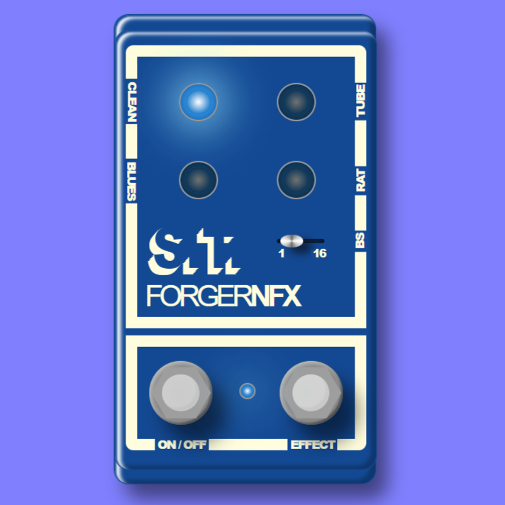

# Forger Neural Effect on Bela


<p align="center">
  
</p>
<p align="center">
  <a href="https://youtu.be/2kOvCCvieIw">Video presentation</a> | <a href="https://youtu.be/tF_DCMwAfec">Video Demo</a>  
</p>

## Selected Topics in Music and Acoustic Enginering
Repository for Selected Topics in Music and Acoustic Enginering 2022/23 Course at Politecnico di Milano.


## Abstract
This project is a real-time neural-effects multi guitar distortion, developed using the RTneural framework on the Bela platform.
The deep model is based on LSTM networks and performs time-domain filtering on the received audio inputs. The model is trained on audio samples of the same instrument recorded both with a clean tone and the distorted one. Two different pipelines are implemented, providing suitable dataset formats ready-to-use for the model training, depending on the nature of the data available.
The effect is to be run onto the Bela machine and can be controlled thanks to a GUI, available trough the bela IDE.
Code able to perform some performance evaluation testing and comparing the latency and sound quality is also available, together with specific tests on Bela’s performances.
This project is a proof of concept, thatfor the potential of tiny machine learning for innovative real-time audio processing systems proving its interest and encouraging the research and development of audio effects and other audio-related domains in such context.

## Training
The model training is developed with python and pytorch, all related code is found in the [training folder](training/).
Different training options and model hyperparameters are available.

### Environment Setup 
- Install [conda](https://conda.io/projects/conda/en/stable/user-guide/install/index.html)
- Open the conda terminal and navigate to the project folder
- Deactivate and remove existing environment:

```
conda deactivate
conda env remove -p ./venv
```

- Create the new environment:
```
conda env create --prefix ./venv --file environment.yml
conda activate ./venv
```

### Environment Update 
If you need a new package while developing, update the content of the environment.yml file and run:
```
shell script
conda env update --prefix ./venv --file environment.yml  --prune
```

### Config
The training configurations is controlled by the [config.py](training/config/config.py) file, which is to be created copying the [template](training/config/config.py.ini) that shows the available options.

### Scripts
- The [train.py](training/scripts/train.py) script launches the training. It is ready to go and its options are specified in the [config.py](training/config/config.py) file.
- A file for renaming files called [rename_goodsound_sax_neumann.py](training/scripts/rename_goodsound_sax_neumann.py) is used for renaming files and make them compatible with the dataset pipeline.
- The [generate.py](training/scripts/generate.py) script allows to run a single file thorugh the model.
- The [evaluation](training/scripts/evaluation) folder contains scripts used for performance evaluation. 

## Inference
The inference is to be performed directly on the Bela machine. All code related to the inference is found in the [evaluation folder](evaluation/)

### Bela Cross Compilation 
Build executables compatible with bela, from the evaluation folder, run the following commands:
- `cmake -B build -DCMAKE_TOOLCHAIN_FILE:FILEPATH=Toolchain.cmake -DRTNEURAL_XSIMD=ON .`
- `cmake --build build -j$(nproc) --target bela_executable`

### Load files on Bela
From the evaluation folder, run the following commands:

- Copy executable on Bela: 
`scp build/bin/bela_executable root@192.168.6.2:~/Bela/projects/bela_executable`

- Copy model weights files on Bela:
```
scp resources/model/BluesDriverNeck_egfx_bl1lstm6.json root@192.168.6.2:~/Bela/projects/bela_executable
scp resources/model/BluesDriverNeck_egfx_bl16lstm64.json root@192.168.6.2:~/Bela/projects/bela_executable
scp resources/model/RATNeck_egfx_bl1lstm6.json root@192.168.6.2:~/Bela/projects/bela_executable
scp resources/model/RATNeck_egfx_bl16lstm64.json root@192.168.6.2:~/Bela/projects/bela_executable
scp resources/model/TubeScreamerNeck_egfx_bl1lstm6.json root@192.168.6.2:~/Bela/projects/bela_executable
scp resources/model/TubeScreamerNeck_egfx_bl16lstm64.json root@192.168.6.2:~/Bela/projects/bela_executable
```

- Copy render file for GUI on Bela: 
`scp src/sketch.js root@192.168.6.2:~/Bela/projects/bela_executable`

> [!WARNING]
> the Bela IP address may be different different for you.

### Running on Bela
- Access bela from your linux terminal (preferrably Debian):
`ssh root@192.168.6.2`

- Navigate to the copied folder:
`cd Bela/projects/bela_executable`

- Run the executable:
`./bela_executable`


## Contributions
| | Colombo | Superbo | 
|:---------------------------------- |:-----------------:|:-----------------:|
| Dataset Pipelines | [](#)| [](#)|
| Models | [](#) | [](#)|
| Training code | [](#) | [](#)|
| Model training | [](#) | [](#)|
| Performance evaluation  | [](#)| [](#)|
| Cross-compilation | [](#) | [](#)|
| Inference code | [](#) | [](#)|
| GUI | [](#)| [](#)|
| Report | [](#) | [](#)|
| Presentation | [](#)| [](#)|
